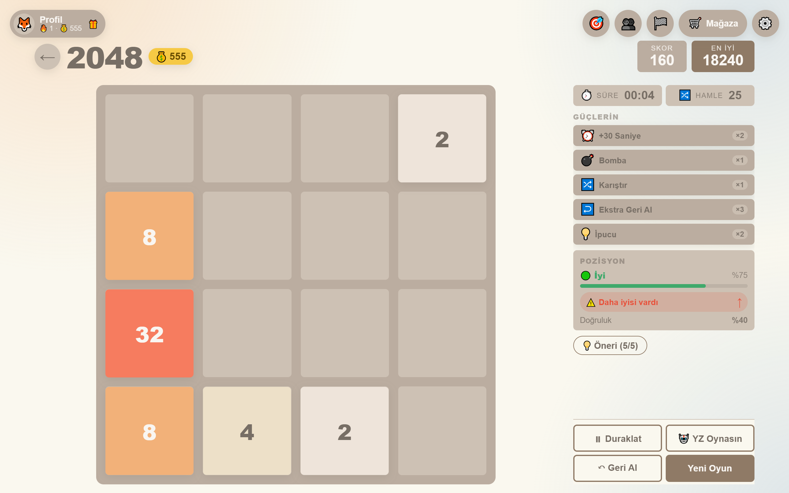
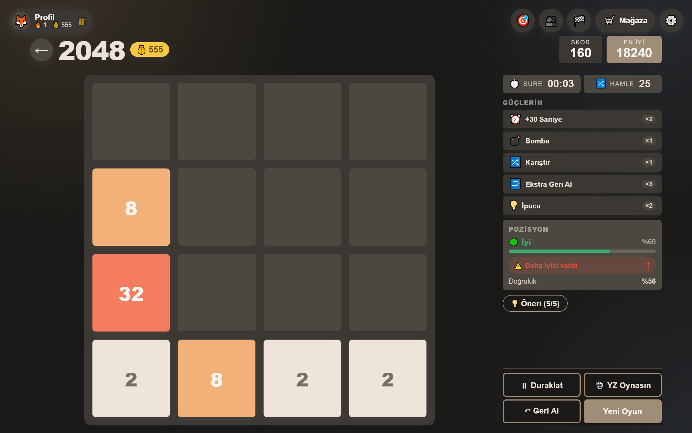
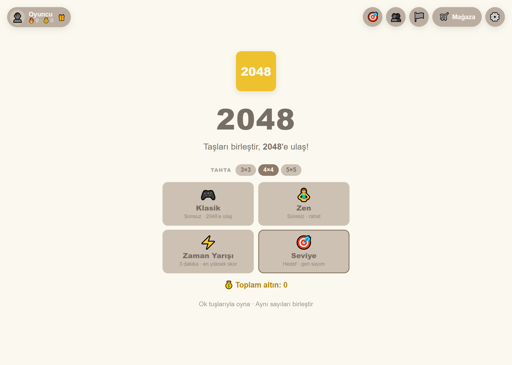
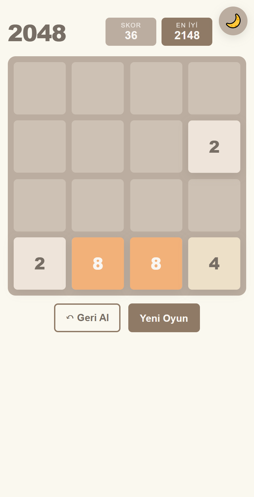

# 2048 — Sayı Birleştirme Bulmacası

Klasik **2048** oyununun Angular ile sıfırdan yeniden yazımı. Standalone bileşen
mimarisi, signal tabanlı durum yönetimi, saf ve test edilebilir oyun mantığı.

## 🎮 Canlı Oyna

### **http://34.158.136.9/emre/2048/**

Bilgisayarda **ok tuşlarıyla**, telefonda **parmakla kaydırarak** oynanır.

## Ekran Görüntüleri

| Açık tema | Koyu tema |
|-----------|-----------|
|  |  |

| Başlık ekranı | Mobil |
|---------------|-------|
|  |  |

## Nasıl oynanır

- Ok tuşlarıyla (↑ ↓ ← →) veya parmakla kaydırarak kareleri it.
- Aynı sayıya sahip iki kare çarpışınca **birleşir** ve değerleri toplanır (2+2=4).
- Bir hamlede her kare **en fazla bir kez** birleşir (zincirleme yok: `2 2 4` → `4 4`).
- Her geçerli hamleden sonra boş bir hücreye yeni kare gelir (%90 "2", %10 "4").
- Amaç **2048** karesine ulaşmak. Ulaşınca "Devam Et" ile oynamaya devam edebilirsin.
- Izgara dolup hiç birleşme kalmayınca oyun biter.

**Seviye Modu:** Her seviyede belirli bir hedef kareye (128 → 256 → 512 → 1024 → 2048)
verilen süre içinde ulaşman gerekir. İlerledikçe süre kısalır (3:00 → 1:30), oyun
zorlaşır. Süre dolar veya hamle biterse seviye başarısız olur ("Tekrar Dene").
Hedefe ulaşınca sonraki seviyeye geçersin. Ulaştığın en yüksek seviye kaydedilir.

## Özellikler

- 🎯 **Doğru 2048 mantığı** — saf, framework'süz, tam test edilmiş
- ⌨️ **Klavye + dokunmatik** — ok tuşları ve swipe
- ⏱️ **Süre ve hamle sayacı** — üstte gösterim, sonuç ekranında toplam
- 🎯 **Seviye modu** — her seviyede hedef kare + geri sayım; ilerledikçe süre kısalır, hedef büyür; ulaşılan seviye kaydedilir
- 💰 **Altın + Mağaza** — seviye tamamlayınca altın kazan; mağazadan güç/tema al
- ⚡ **Güçler** — ⏰ +30sn · 💣 bomba (kare sil) · 🔀 karıştır · ↩️ geri al · 💡 ipucu
- 🎨 **Temalar** — Neon, Okyanus, Orman, Gün Batımı (altınla açılır)
- 👤 **Profil** — isim, istatistik, gün serisi, başarımlar
- 🎁 **Günlük ödül + seri** — her gün oyna, seriye göre altın kazan
- 🏅 **Başarımlar** — altın ödüllü hedefler
- ↶ **Geri al** — son hamleyi geri al (kaybettiren hamle dahil)
- 🏆 **Kalıcı rekor** — en yüksek skor `localStorage`'da saklanır
- ⚙️ **Ayarlar paneli** — müzik, ses seviyeleri, tema (tercihler kalıcı)
- 🎵 **Arka plan müziği** — "Calm Mind – Chill Lofi Beat" (Pixabay)
- 🔊 **Ses efektleri** — Web Audio ile prosedürel (hamle / birleşme)
- 🌙 **Açık/koyu tema** — tercih kalıcı, sistem tercihini varsayılan alır
- ✨ **Akıcı animasyonlar** — kayma, pop-in, birleşme "bump"ı
- 📱 **Responsive** — telefon, tablet, masaüstü
- ♿ **Erişilebilirlik** — `prefers-reduced-motion`, odak halkaları, 44px dokunma hedefleri

## Teknolojiler

- [Angular 22](https://angular.dev/) — standalone bileşenler, **signals**
- TypeScript
- SCSS (CSS değişkenleriyle temalama)
- Web Audio API (prosedürel ses efektleri)
- Vitest (111 birim/bileşen testi)
- Backend yok — tamamen istemci tarafı

## Proje yapısı

```
src/
  app/
    components/
      board/           # 4×4 ızgara zemini + kare katmanı
      tile/            # Tek kare: renk, konum, animasyonlar
      start-screen/    # Başlık ekranı
    services/
      game.service.ts  # Oyun durumu (signals) + skor + süre/hamle + geri al
      theme.service.ts # Açık/koyu tema (localStorage)
      audio.service.ts # Arka plan müziği (loop, ses, kalıcı)
      sfx.service.ts   # Ses efektleri (Web Audio, prosedürel)
    logic/
      board-logic.ts   # SAF hamle mantığı (kaydırma + birleştirme)
      swipe.ts         # SAF dokunmatik yön tespiti
      format-time.ts   # SAF süre biçimlendirme (mm:ss)
    models/
      tile.model.ts    # Tile, Grid, Direction, GameStatus
  styles/
    _variables.scss    # Kare paleti, ölçüler, animasyon süreleri
    _base.scss         # Tema değişkenleri (:root + [data-theme=dark])
```

**Mimari not:** Oyun mantığı (`logic/`) Angular'dan tamamen bağımsızdır —
saf fonksiyonlar, girdiyi değiştirmez. Bu sayede hızlı ve güvenilir test edilir.
Kare **id'leri** hamleler arasında korunur; kayma animasyonu bunun üzerine kurulur.

## Hızlı başlat (Windows)

**`oyna.bat`** dosyasına çift tıkla — sunucuyu başlatır ve oyunu tarayıcıda açar
(ilk çalıştırmada paketleri de kurar).

## Kurulum ve geliştirme

Gereksinim: [Node.js](https://nodejs.org/) 20+

```bash
# Bağımlılıkları kur
npm install

# Geliştirme sunucusu → http://localhost:4200/
npm start

# Telefondan test etmek için (aynı Wi-Fi, bilgisayarın IP'si ile)
npx ng serve --host 0.0.0.0
```

## Testler

```bash
npm test
```

**81 test**, hepsi geçiyor. Kapsam ve elle test kontrol listesi: [TEST-NOTES.md](TEST-NOTES.md)

## Derleme ve deploy

```bash
# Üretim derlemesi (kök dizine kurulacaksa)
npm run build

# Alt dizine kurulacaksa base-href gerekir
npx ng build --base-href /emre/2048/
```

Çıktı `dist/game2048/browser/` klasörüne yazılır — statik dosyalar, herhangi bir
web sunucusuyla servis edilebilir. Canlı sürüm bu dosyaların
`/var/www/emre/2048/` altına kopyalanmasıyla yayınlanmıştır.

## Yol haritası

- [x] Proje iskeleti (Angular + SCSS teması)
- [x] Başlık / açılış ekranı
- [x] Izgara veri modeli + signal state
- [x] 4×4 tahta ve kare bileşenleri
- [x] Hamle ve birleştirme mantığı (saf, test edilebilir)
- [x] Rastgele yeni kare üretimi
- [x] Klavye (ok tuşu) + dokunmatik (swipe) kontrolleri
- [x] Skor + en yüksek skor kalıcılığı (localStorage)
- [x] Kazandın / kaybettin ekranları (overlay + "Devam Et")
- [x] Animasyonlar: kayma + pop-in + bump (`prefers-reduced-motion` destekli)
- [x] Geri al (tek adım) + yeni oyun
- [x] Responsive tasarım (mobil / tablet / masaüstü)
- [x] Açık/koyu tema (kalıcı), favicon, meta bilgileri
- [x] Test ve hata ayıklama (100 test)
- [x] **Deploy ve teslim** ✅

### Ek özellikler (Panora iş paketleri)

- [x] Süre ve hamle sayacı (üstte gösterim + sonuç ekranında)
- [x] Ayarlar paneli (⚙️ sağ üstte): müzik, ses seviyeleri, tema
- [x] Arka plan müziği (Pixabay, kalıcı, aç/kapa + ses)
- [x] Ses efektleri (Web Audio ile prosedürel: hamle / birleşme)
- [x] Seviye modu (hedef + geri sayım, ilerledikçe zorlaşır, kayıtlı ilerleme)
- [x] Altın ödül sistemi (seviye tamamlama, kalıcı, ilk tamamlamada ödül)
- [x] Mağaza + güçler (⏰+30sn, 💣bomba, 🔀karıştır, ↩️geri al, 💡ipucu)
- [x] Satın alınabilir temalar (Neon, Okyanus, Orman, Gün Batımı)
- [x] Profil + istatistik (oyun, kazanma %, en iyi kare, seri, toplam hamle)
- [x] Gün serisi (streak) + günlük ödül (seriye göre altın)
- [x] Başarımlar (altın ödüllü hedefler)
