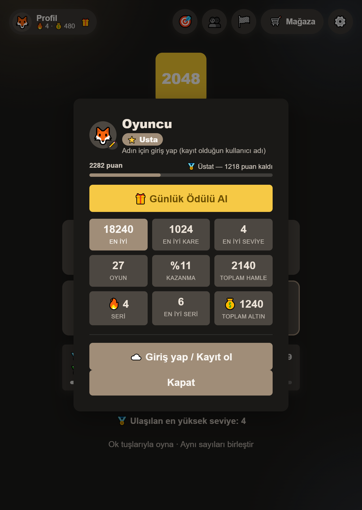
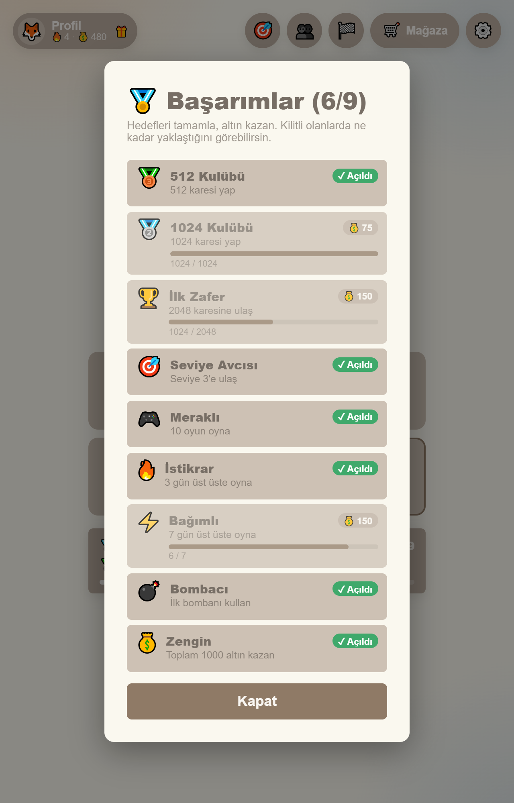
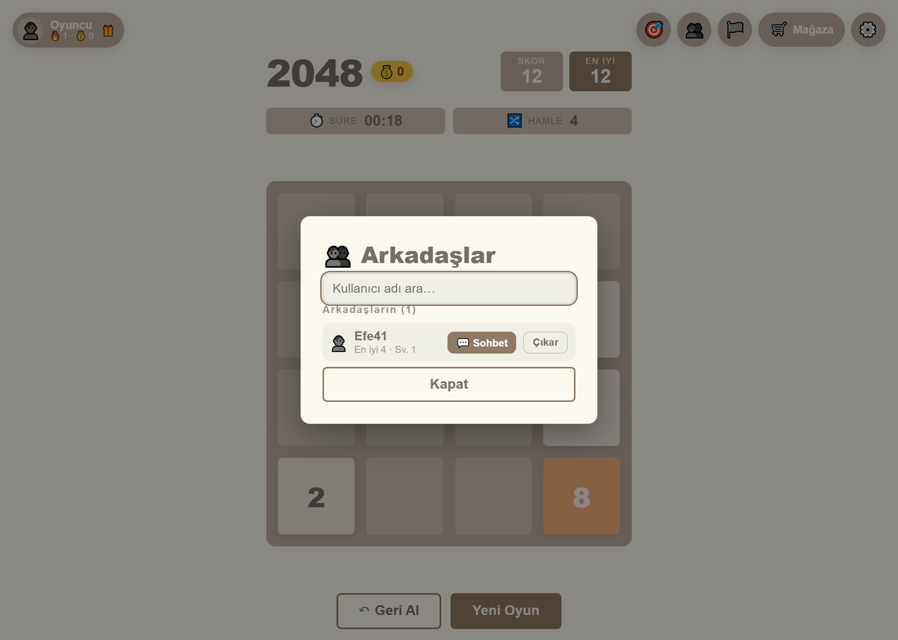
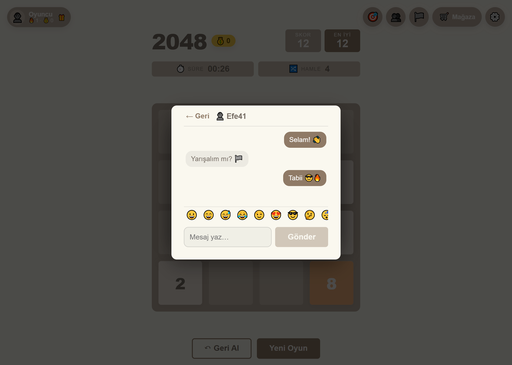
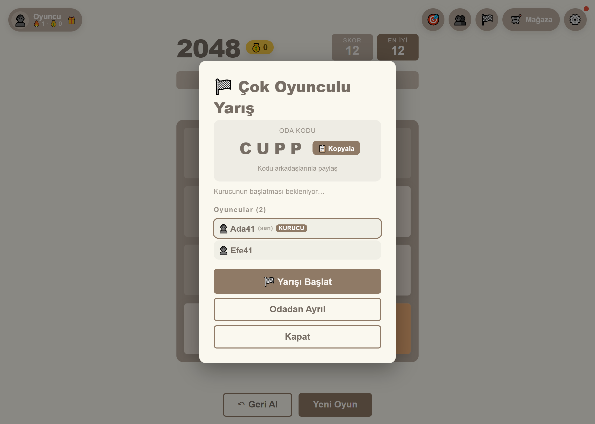

# 2048 — Sayı Birleştirme Bulmacası

Klasik **2048** oyununun Angular ile sıfırdan yeniden yazımı. Standalone bileşen
mimarisi, signal tabanlı durum yönetimi, saf ve test edilebilir oyun mantığı.

## 🎮 Canlı Oyna

### **http://34.158.136.9/emre/2048/**

Bilgisayarda **ok tuşlarıyla**, telefonda **parmakla kaydırarak** oynanır.

## Ekran Görüntüleri

| Açık tema | Koyu tema |
|-----------|-----------|
|  |  |

| Başlık ekranı | Mobil |
|---------------|-------|
|  |  |

| Profil (ünvan + avatar) | Başarımlar (ilerleme çubuklu) |
|-------------------------|-------------------------------|
|  |  |

### Çevrimiçi özellikler

| Arkadaşlar | Sohbet | Çok oyunculu yarış |
|-----------|--------|--------------------|
|  |  |  |

## Nasıl oynanır

- Ok tuşlarıyla (↑ ↓ ← →) veya parmakla kaydırarak kareleri it.
- Aynı sayıya sahip iki kare çarpışınca **birleşir** ve değerleri toplanır (2+2=4).
- Bir hamlede her kare **en fazla bir kez** birleşir (zincirleme yok: `2 2 4` → `4 4`).
- Her geçerli hamleden sonra boş bir hücreye yeni kare gelir (%90 "2", %10 "4").
- Amaç **2048** karesine ulaşmak. Ulaşınca "Devam Et" ile oynamaya devam edebilirsin.
- Izgara dolup hiç birleşme kalmayınca oyun biter.

**Seviye Modu:** Her seviyede belirli bir hedef kareye (128 → 256 → 512 → 1024 → 2048)
verilen süre içinde ulaşman gerekir. İlerledikçe süre kısalır (3:00 → 1:30), oyun
zorlaşır. Süre dolar veya hamle biterse seviye başarısız olur ("Tekrar Dene").
Hedefe ulaşınca sonraki seviyeye geçersin. Ulaştığın en yüksek seviye kaydedilir.

## 🤖 Yapay zekâ

Oyunun içinde, **API anahtarı ve internet gerektirmeyen** bir yapay zekâ çalışır:
`logic/ai.ts` içindeki **expectimax** arama motoru (yılan-gradyan sezgiseli, şans
düğümü örneklemesi, sert düğüm bütçesi). Tüm YZ özellikleri bu tek motordan gelir:

- 💡 **Hamle önerisi** — oyun başına 5 hak; en iyi yönü ok olarak gösterir
- 🤖 **YZ gösterimi** — "YZ Oynasın" ile motoru izle. **Yalnızca örnektir:** durdurunca
  tahtan, skorun, sürün ve hakların aynen geri gelir; ilerlemen etkilenmez
- 🏁 **YZ rakibi** — çok oyunculu odaya 3 zorlukta bot ekle (Kolay / Orta / Uzman);
  bot da insanla **aynı tohumlu** taş dizisini oynar
- ✨ **Hamle kalitesi** — her hamlen YZ'nin seçimiyle kıyaslanır: *Mükemmel · İyi ·
  Daha iyisi vardı (↑)* — oyun sonunda **doğruluk yüzdesi** özeti
- 🟢 **Canlı pozisyon göstergesi** — tahtanın sağlığı (İyi / Riskli / Tehlikeli);
  boş alan, köşe kullanımı ve kalan hamle yönlerinden hesaplanır
- 🔍 **Oyun sonu değerlendirmesi** — köşe stratejisi, verimlilik ve kişisel ipucu

Ayarlar'daki **🧠 YZ Asistanı** anahtarı öneri, hamle kalitesi ve pozisyon
göstergesini birlikte açar/kapatır. Hamle başına ek maliyet ortanca **~2 ms**
(en kötü ~40 ms) — arayüz hiç takılmaz.

## Özellikler

- 🎯 **Doğru 2048 mantığı** — saf, framework'süz, tam test edilmiş
- ⌨️ **Klavye + dokunmatik** — ok tuşları ve swipe
- ⏱️ **Süre ve hamle sayacı** — üstte gösterim, sonuç ekranında toplam
- 🎯 **Seviye modu** — her seviyede hedef kare + geri sayım; ilerledikçe süre kısalır, hedef büyür; ulaşılan seviye kaydedilir
- 💰 **Altın + Mağaza** — seviye tamamlayınca altın kazan; mağazadan güç/tema al
- ⚡ **Güçler** — ⏰ +30sn · 💣 bomba (kare sil) · 🔀 karıştır · ↩️ geri al · 💡 ipucu
- 🎨 **Temalar** — Neon, Okyanus, Orman, Gün Batımı (altınla açılır)
- 👤 **Profil** — avatar seçimi, **ünvan** (Çırak → Kalfa → Usta → Üstat → Efsane),
  9 istatistik, gün serisi
- 🏅 **Başarımlar** — ana ekranda özet şerit, panelde **ilerleme çubuklu** liste
  ("512 Kulübü — 128/512")
- ⏸️ **Duraklat** — yalnızca tahtayı örter, sayaç durur
- 🎁 **Günlük ödül + seri** — her gün oyna, seriye göre altın kazan
- 🎯 **Görevler** — günlük ve haftalık görevler; oynadıkça ilerler, altın verir
- 🌍 **Dil (TR/EN)** — Ayarlar'dan geçiş; arayüzün tamamı iki dilde
- 🎮 **Modlar** — Klasik · Zen (süresiz) · Zaman Yarışı (3dk) · Seviye + tahta boyutu (3×3/4×4/5×5)
- 👤 **Hesap** — kayıt/giriş (kullanıcı adı + e-posta), ilerleme buluta kaydı, cihazlar arası senkron
- 👥 **Arkadaşlar** — kullanıcı ara, istek gönder/kabul et, arkadaş listesi (skor/seviye özeti)
- 💬 **Sohbet** — arkadaşlar arası mesajlaşma, emoji seçici, okunmamış rozeti (yakın-gerçek zamanlı)
- 🏁 **Çok oyunculu yarış** — oda kur, 4 haneli kodla davet, ortak tohumla adil yarış + canlı skor tablosu
- 🏠 **Ana ekran** — başlığa / mod seçimine dönüş (oyun ekranında ← tuşu)
- 🖥️ **İki sütunlu düzen** — geniş ekranda solda büyük tahta, sağda bilgi paneli
  (süre, güçler, YZ, kontroller); dar ekranda tek sütuna iner
- ↶ **Geri al** — son hamleyi geri al (kaybettiren hamle dahil)
- 🏆 **Kalıcı rekor** — en yüksek skor `localStorage`'da saklanır
- ⚙️ **Ayarlar paneli** — müzik, ses seviyeleri, tema (tercihler kalıcı)
- 🎵 **Arka plan müziği** — "Calm Mind – Chill Lofi Beat" (Pixabay)
- 🔊 **Ses efektleri** — Web Audio ile prosedürel (hamle / birleşme)
- 🌙 **Açık/koyu tema** — tercih kalıcı, sistem tercihini varsayılan alır
- ✨ **Akıcı animasyonlar** — kayma, pop-in, birleşme "bump"ı
- 📱 **Responsive** — telefon, tablet, masaüstü
- ♿ **Erişilebilirlik** — `prefers-reduced-motion`, odak halkaları, 44px dokunma hedefleri

## Teknolojiler

- [Angular 22](https://angular.dev/) — standalone bileşenler, **signals**
- TypeScript
- SCSS (CSS değişkenleriyle temalama)
- Web Audio API (prosedürel ses efektleri)
- Expectimax oyun ağacı araması (yapay zekâ — bağımlılıksız, saf TypeScript)
- Vitest (220 birim/bileşen testi)
- **Backend:** Python standart kütüphanesi — `http.server` + `sqlite3` + `pbkdf2` (hesap,
  arkadaşlar, sohbet, çok oyunculu yarış). Ek bağımlılık yok; nginx arkasında ayrı serviste çalışır.

## Proje yapısı

```
src/
  app/
    components/
      board/           # 4×4 ızgara zemini + kare katmanı
      tile/            # Tek kare: renk, konum, animasyonlar
      start-screen/    # Başlık ekranı
    services/
      game.service.ts        # Oyun durumu (signals) + skor + süre/hamle + geri al + yarış (tohumlu RNG)
      theme.service.ts       # Açık/koyu tema (localStorage)
      audio.service.ts       # Arka plan müziği (loop, ses, kalıcı)
      sfx.service.ts         # Ses efektleri (Web Audio, prosedürel)
      i18n.service.ts        # Dil (TR/EN) — statik metin + model verisi çevirisi
      auth.service.ts        # Hesap: kayıt/giriş, token, ilerleme senkronu
      friends.service.ts     # Arkadaşlar: ara/istek/kabul/liste (yoklamalı)
      chat.service.ts        # Sohbet: mesaj gönder/al, okunmamış rozeti
      multiplayer.service.ts # Çok oyunculu: oda/kod/başlat + canlı ilerleme
      ai.service.ts          # Oyun sonu değerlendirmesi (algoritmik, anahtarsız)
    logic/
      board-logic.ts   # SAF hamle mantığı (kaydırma + birleştirme)
      ai.ts            # SAF yapay zekâ: expectimax + hamle kalitesi + pozisyon sağlığı
      bot-runner.ts    # SAF bot koşucusu (çok oyunculu YZ rakibi, tohumlu)
      rank.ts          # SAF ünvan hesabı (puan → rütbe + ilerleme)
      missions.ts      # SAF görev üretimi + ISO gün/hafta anahtarları
      swipe.ts         # SAF dokunmatik yön tespiti
      format-time.ts   # SAF süre biçimlendirme (mm:ss)
    models/
      tile.model.ts    # Tile, Grid, Direction, GameStatus, GameMode
  styles/
    _variables.scss    # Kare paleti, ölçüler, animasyon süreleri
    _base.scss         # Tema değişkenleri (:root + [data-theme=dark])
server/
  app.py               # Backend: hesap + arkadaşlar + sohbet + çok oyunculu (Python stdlib)
```

## Backend (çevrimiçi özellikler)

Hesap, arkadaşlar, sohbet ve çok oyunculu yarış için `server/app.py` küçük bir
Python servisidir (yalnızca standart kütüphane — `http.server`, `sqlite3`,
`hashlib.pbkdf2`). Şifreler tuzlanıp özetlenir; oturumlar Bearer token ile taşınır.
JSON uçları: `/register` · `/login` · `/me` · `/sync` · `/friends*` · `/messages*` ·
`/rooms*`. Çok oyunculu yarışta tüm oyunculara **ortak tohum** gönderilir; böylece
herkes birebir aynı taş dizisini alır (adil yarış), skorlar ~1sn'de bir eşitlenir.

Güvenlik önlemleri: PBKDF2-SHA256 (600k tur, kullanıcıya özel tuz), sabit zamanlı
karşılaştırma, oturum jetonu **süre sınırı**, girişte hız sınırı, istek gövdesi üst
sınırı, oda durumunda **üyelik kontrolü** (tohum sızıntısını önler), skor
doğrulaması (yarış bittikten sonra veya aralık dışı skor kabul edilmez) ve tüm
hataların JSON yanıta çevrilmesi.

```bash
python3 server/app.py     # 127.0.0.1:8092 (GAME2048_PORT ile değiştirilebilir)
```

**Mimari not:** Oyun mantığı (`logic/`) Angular'dan tamamen bağımsızdır —
saf fonksiyonlar, girdiyi değiştirmez. Bu sayede hızlı ve güvenilir test edilir.
Kare **id'leri** hamleler arasında korunur; kayma animasyonu bunun üzerine kurulur.

## Hızlı başlat (Windows)

**`oyna.bat`** dosyasına çift tıkla — sunucuyu başlatır ve oyunu tarayıcıda açar
(ilk çalıştırmada paketleri de kurar).

## Kurulum ve geliştirme

Gereksinim: [Node.js](https://nodejs.org/) 20+

```bash
# Bağımlılıkları kur
npm install

# Geliştirme sunucusu → http://localhost:4200/
npm start

# Telefondan test etmek için (aynı Wi-Fi, bilgisayarın IP'si ile)
npx ng serve --host 0.0.0.0
```

## Testler

```bash
npm test
```

**220 test**, hepsi geçiyor. Kapsam ve elle test kontrol listesi: [TEST-NOTES.md](TEST-NOTES.md)

Testlerin bir bölümü **regresyon testidir**: kod denetiminde bulunan hatalar
(geri almanın sayacı yeniden başlatmaması, karıştırma gücünün tahtayı
kilitlemesi, ISO hafta anahtarı çakışması, YZ'nin ilerlemeyi etkilemesi vb.)
düzeltildikten sonra bir daha geri gelmesin diye kilitlendi.

## Derleme ve deploy

```bash
# Üretim derlemesi (kök dizine kurulacaksa)
npm run build

# Alt dizine kurulacaksa base-href gerekir
npx ng build --base-href /emre/2048/
```

Çıktı `dist/game2048/browser/` klasörüne yazılır — statik dosyalar, herhangi bir
web sunucusuyla servis edilebilir. Canlı sürüm bu dosyaların
`/var/www/emre/2048/` altına kopyalanmasıyla yayınlanmıştır.

## Yol haritası

- [x] Proje iskeleti (Angular + SCSS teması)
- [x] Başlık / açılış ekranı
- [x] Izgara veri modeli + signal state
- [x] 4×4 tahta ve kare bileşenleri
- [x] Hamle ve birleştirme mantığı (saf, test edilebilir)
- [x] Rastgele yeni kare üretimi
- [x] Klavye (ok tuşu) + dokunmatik (swipe) kontrolleri
- [x] Skor + en yüksek skor kalıcılığı (localStorage)
- [x] Kazandın / kaybettin ekranları (overlay + "Devam Et")
- [x] Animasyonlar: kayma + pop-in + bump (`prefers-reduced-motion` destekli)
- [x] Geri al (tek adım) + yeni oyun
- [x] Responsive tasarım (mobil / tablet / masaüstü)
- [x] Açık/koyu tema (kalıcı), favicon, meta bilgileri
- [x] Test ve hata ayıklama (100 test)
- [x] **Deploy ve teslim** ✅

### Ek özellikler (Panora iş paketleri)

- [x] Süre ve hamle sayacı (üstte gösterim + sonuç ekranında)
- [x] Ayarlar paneli (⚙️ sağ üstte): müzik, ses seviyeleri, tema
- [x] Arka plan müziği (Pixabay, kalıcı, aç/kapa + ses)
- [x] Ses efektleri (Web Audio ile prosedürel: hamle / birleşme)
- [x] Seviye modu (hedef + geri sayım, ilerledikçe zorlaşır, kayıtlı ilerleme)
- [x] Altın ödül sistemi (seviye tamamlama, kalıcı, ilk tamamlamada ödül)
- [x] Mağaza + güçler (⏰+30sn, 💣bomba, 🔀karıştır, ↩️geri al, 💡ipucu)
- [x] Görevler (günlük + haftalık, tarih tohumlu, altın ödüllü)
- [x] Satın alınabilir temalar (Neon, Okyanus, Orman, Gün Batımı)
- [x] Profil + istatistik (oyun, kazanma %, en iyi kare, seri, toplam hamle)
- [x] Gün serisi (streak) + günlük ödül (seriye göre altın)
- [x] Başarımlar (altın ödüllü hedefler)
- [x] Dil sistemi (TR/EN) — arayüzün tamamı iki dilde
- [x] Hesap sistemi (kayıt/giriş + e-posta, buluta ilerleme senkronu) — Python backend
- [x] Arkadaşlar (ara / istek / kabul / liste)
- [x] Sohbet (emoji'li, yakın-gerçek zamanlı, okunmamış rozeti)
- [x] Çok oyunculu yarış (oda kur, kodla davet, ortak tohumla canlı yarış)
- [x] **Yapay zekâ** (expectimax motoru: öneri, gösterim, bot rakip, hamle
      kalitesi, pozisyon göstergesi, oyun sonu değerlendirmesi)
- [x] Duraklatma (yalnızca tahtayı örten efekt)
- [x] Arayüz düzeni (geniş ekranda tahta + yan panel, isimli güçler)
- [x] Profil yenileme (avatar seçimi, ünvan sistemi, başarım ilerlemesi)
- [x] Kod denetimi ve hata düzeltmeleri (oyun mantığı, arayüz servisleri, backend)
